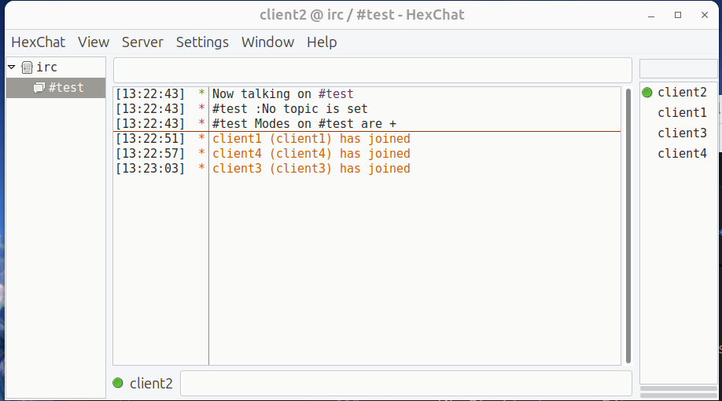

# IRC

An IRC server is the central piece of **I**nternet **R**elay **C**hat, acting like a meeting point for users who want to chat with each other. IRC server acts as a central hub, facilitating connections between clients and enabling communication across channels 
and networks Here's a breakdown of the key components:
- **Server Software:** This is the core program running on a computer, handling connections from IRC clients and managing communication between them. There are various open-source and proprietary IRC server software options available.
- **Clients:** These are the applications users run on their devices (phones, laptops) to connect to the IRC server and participate in chats. Some popular IRC clients include mIRC, HexChat, and irssi.
- **Networks:** An IRC network is a collection of interconnected servers that allows users on any server within the network to communicate with each other. This enables a wider reach compared to a single server.
- **Channels:** These are virtual chat rooms within the network where users can gather and discuss specific topics or interests. Users can join and leave channels at will.
- **Protocol (IRC):** This is the set of rules and commands that define how IRC servers and clients communicate with each other. It uses TCP for data transfer and optionally TLS for encryption.


```


