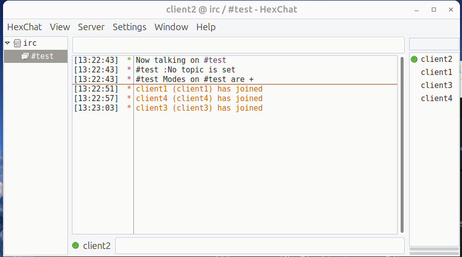

# IRC


An IRC server is the central piece of **I**nternet **R**elay **C**hat, acting like a meeting point for users who want to chat with each other. IRC server acts as a central hub, facilitating connections between clients and enabling communication across channels 
and networks Here's a breakdown of the key components:
- **Server Software:** This is the core program running on a computer, handling connections from IRC clients and managing communication between them. There are various open-source and proprietary IRC server software options available.
- **Clients:** These are the applications users run on their devices (phones, laptops) to connect to the IRC server and participate in chats. Some popular IRC clients include mIRC, HexChat, and irssi.
- **Networks:** An IRC network is a collection of interconnected servers that allows users on any server within the network to communicate with each other. This enables a wider reach compared to a single server.
- **Channels:** These are virtual chat rooms within the network where users can gather and discuss specific topics or interests. Users can join and leave channels at will.
- **Protocol (IRC):** This is the set of rules and commands that define how IRC servers and clients communicate with each other. It uses TCP for data transfer and optionally TLS for encryption.

## Channel
An IRC channel is a virtual room where multiple users can chat simultaneously. It's like a public chat room with a specific topic or interest. Users can join and leave channels as they please, and messages sent in a channel are visible to everyone in that channel. 
### Channel commands:
Our IRC server has to cover commands JOIN, INVITE, KICK, MODE, TOPIC, PRIVMSG. Those can be used by registered users that have to provide correct PASS, and unique NICK nad USER credentials.
The client is sending command that is then being parsed by the server and then server is sending a response, in a following format
```
[prefix] command [parameters] [trailing parameters]
:ourSuperServer 001 client1 :Welcome to ft_irc server! - example
```

 **JOIN** - join and create channel if it doesn't exist
  
   Has only one parameter `channel name` </br>
   Channel name has to start with a `#` cannot contain bell signs, spaces and a commas, alse cannot be longer than 50 characters </br>
  `JOIN #channelName` - sent from client </br>
  If the channel doesn't exist it is also creating it's instance and the person becomes an operator of that channel.


**TOPIC** - Change or view the channel topic 
  
  Has two parameters `#channelName` and  `topic` that is a description of the channel content. Can have several words, starts with `:`
  `TOPIC  #channelName :This is channel topic` 
  


**INVITE** - Invite a client to a channel
  
  Has two parameters `nickname` and  `#channelNane`
  `INVITE client2 #channelName`

**KICK** -  Eject a client from the channel
  
  Has three parameters `#channelName`, `nickname` and `message`. If message is not provided, the default one is being taken as a parameter.
  In order to to use you have to be an operator of a channel, normal users cannot kick anyone. Operators can kick other operators, but cannot kick themselves.
  `KICK #channelName client2 :you are being kicked`


**MODE** - Change the channel’s mode or see active modes


